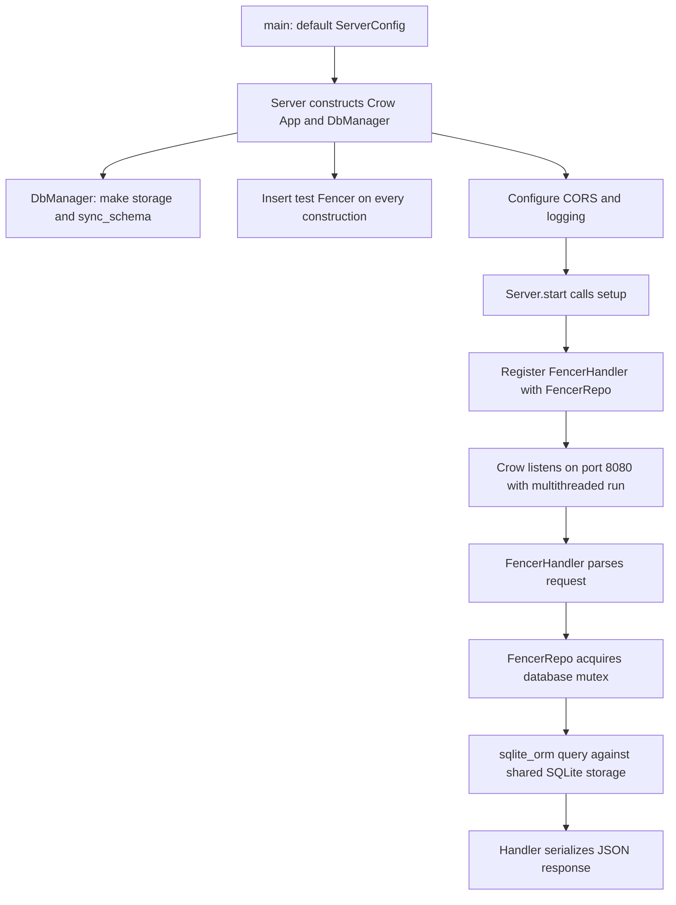

# Project context

Reviewed on 2026-10-08 against `54e1ffe` (`readme`). All application headers,
sources, tests, build files, README, and `notes` were read, with recent Git history
used to identify the handoff point. `libs/sqlite/` is third-party amalgamated
SQLite, inspected for its version and build integration rather than audited
line by line. Findings and the next work sequence live in
[continuation-plan.md](continuation-plan.md).

## Purpose and scope

AusFencer aims to reduce fencing-club friction around scoring equipment by
storing completed bouts and finding Fencers and their bout histories. README
also sketches a future mobile referee tool: a three-minute timer, scores up to
99, score controls, and yellow/red card controls. Tournament features are
crossed out. Guest participants and ordered teams of three are ideas, not
implemented functionality.

This checkout is a backend only. There are no UI assets, client, authentication
implementation, deployment configuration, CI workflow, migration scripts, or
environment-based configuration in the tracked files.

## Actual handoff point

Recent commits created the Bout model/schema, copied and adapted the repository,
then copied Fencer handlers and tests by replacing names. Commit `dba2e41`
explicitly says the Bout handler is not done; `fc7203f` identifies the missing
Fencer foreign-key question. The latest commits update comments and README.

| Layer | Fencer | Bout |
| --- | --- | --- |
| Model and schema | Present | Present, weapon mapping needs verification |
| Repository | CRUD, name search, pagination | CRUD, pagination, participant filter present |
| Handler | Implemented | Copied scaffold with wrong fields/signature |
| Production target | Included | Repository and handler omitted |
| Production routes | `/api/fencers` registered | No Bout handler registered |
| Repository tests | Five tests | Five copied tests, currently invalid |
| Handler tests | Five tests | None |

“Implemented” here describes source structure, not a successful build or passing
runtime tests. Do not start another Bout implementation from scratch: finish the
existing files and repair their copied contracts.

## Runtime flow and ownership



- `main` constructs a default config and blocks in `server.start()`. It catches
  `std::exception`, prints the message, and then reaches the end of `main`.
  Arguments are unused; startup failures currently return success.
- `Server` owns a `unique_ptr<App>`, a shared DbManager, and a vector of shared
  `IHandler` pointers. The handler vector preserves the lifetime of callbacks
  capturing `this`. Each concrete handler owns its concrete repository through
  `shared_ptr`; repositories share the DbManager.
- Default port is 8080. `ServerConfig::threads` defaults to 2 but is unused;
  `multithreaded()` selects Crow's worker behavior. `is_running_` is unused too.
- `setup()` currently adds only FencerHandler at `/api/fencers`. It is public and
  unguarded, and `start()` calls it again; repeat setup can register routes twice.
- CORS configuration allows GET/POST/PUT/DELETE/OPTIONS, Content-type and
  Authorization headers, wildcard origin, `/api` prefix, and max age 3600.
  Allowing an Authorization header does not implement authentication.
- Logger middleware logs the URL before handling and URL/status afterward.
  Crow logging level is Info.

## Models and persistence

Both models are plain public structs without constructors, validation, or
default member initializers. Value-initialize new objects and set the fields
deliberately; an uninitialized local struct has indeterminate scalar members.

| Model | Fields |
| --- | --- |
| Fencer | `int id`, `string first_name`, `string last_name`, `int birth_year` |
| Bout | `int id`, `int left_fencer_id`, `int right_fencer_id`, `time_t timestamp`, `Weapon weapon`, `int time`, `int left_score`, `int right_score`, `int left_yellow`, `int right_yellow`, `int left_red`, `int right_red` |

`Weapon` is an unscoped enum: `Foil=0`, `Epee=1`, `Sabre=2`. There is no checked-in
custom sqlite_orm enum binding. `time` is commented as seconds, but the code does
not settle whether it means elapsed, remaining, or configured bout time.
`timestamp` has no documented API units, timezone convention, or default.
The score-cap and yellow-card comments express intentions without enforcing them.

`create_db_storage()` maps `fencers` and `bouts` to the same Storage type. Its
definition is inline in the header because `Storage` is obtained with `decltype`.
Both IDs are autoincrement primary keys. Each Bout participant ID has a foreign
key to Fencer ID. There are no explicit delete/update actions, nullable participant
fields, guest markers, team membership, secondary indexes, or domain checks.

Production uses `db.ausfencer` relative to the process working directory; tests
create fresh `:memory:` databases. `DbManager` calls `sync_schema()` immediately.
This is automatic ORM schema synchronization, not a versioned migration strategy.
Inspect schema changes against existing data before relying on it for upgrades.

`acquire_lock()` returns a RAII `unique_lock` over one mutable mutex. Every
repository method holds that lock for its own storage call and result materialization.
`get_storage()` exposes a mutable reference with no automatic locking. There are
no application-level transactions or locks spanning multiple repository methods.
Do not infer that foreign-key enforcement is disabled from the absence of an
explicit PRAGMA: sqlite_orm may enable it when opening connections; verify the
pinned dependency and the effective connection behavior.

## Repository contracts

`IRepo` exposes only a virtual destructor and `get_name()`. BaseRepo holds the
shared manager and name; there is no shared generic CRUD interface. Concrete
repositories return a newly generated ID from `create`, a `unique_ptr<Model>`
or null from `get`, and no affected-row information from `update`/`remove`.
Create does not rewrite the input object's ID; callers use the returned ID.

- `FencerRepo::get_all(q, page, limit)` returns whole Fencer objects. A nonempty
  `q` becomes `%q%` and matches first OR last name with SQL LIKE. SQL wildcard
  characters supplied in `q` are not escaped. This is not an exact name search
  or a full-name concatenation search.
- `BoutRepo::get_all(page, limit)` returns whole Bout objects.
- `BoutRepo::get_all_by_fencer(fencer_id, page, limit)` matches left OR right
  participant using numeric LIKE. It is not exposed through a working HTTP route.
- All list queries compute `(page - 1) * limit` in `int`, have no explicit ORDER BY,
  and return vectors. Repositories do not validate arguments. The `notes` idea
  of returning ID-only vectors has not been implemented.

## Current Fencer HTTP contract

| Method and route | Inputs | Success response |
| --- | --- | --- |
| GET `/api/fencers` | `q`, `page`, `limit` query parameters | 200, `{"fencers":[...]}` |
| GET `/api/fencers/<int>` | Route ID | 200, one Fencer object |
| POST `/api/fencers` | `first_name`, `last_name`, `birth_year` JSON | 200, stored fields plus generated ID |
| PUT `/api/fencers/<int>` | Route ID and all three JSON fields | 200, updated Fencer object |
| DELETE `/api/fencers/<int>` | Route ID | 200, `{"success":true}` |

GET/PUT/DELETE return 404 for a missing Fencer, through BaseHandler's
`{"status":"error","message":"Fencer not found"}` helper. BaseHandler also
offers 400 and 500 helpers, but current handlers do not use them to validate
JSON or translate database exceptions.

List defaults are page 1 and limit 10. `stoi` results are clamped to at least 1;
conversion exceptions are logged and leave defaults. `stoi` can accept a numeric
prefix with trailing text. There is no upper bound or overflow-safe offset.

POST and PUT access JSON members/types without checking parse success, required
keys, types, integer range, or domain values. PUT is a full replacement of the
three mutable fields. It does not support PATCH. Both PUT and DELETE check
existence with a separate repository call before writing.

## Build and tests

Top-level CMake declares C++17 and minimum CMake 3.10. Its FetchContent calls
actually require at least 3.14; pinned dependencies may require more. A compatible
Crow CMake package, Boost, and system SQLite development files are required.
Crow and Boost are not fetched or pinned. Dependencies fetched at configuration:

- sqlite_orm: `5f1a2ce84a3d72711b4f0a440fdaba977868ae67`.
- GoogleTest: `063de7e9578f82b369302001269680b4b1553359`.

`libs/sqlite/` contains SQLite 3.53.4 source/header files, but neither target builds
that source or adds that directory to its include path. The actual build locates
system SQLite. The application links Crow and sqlite_orm; tests also explicitly
link `SQLite3::SQLite3`. Verify transitive SQLite linkage from the pinned ORM
before labeling the application's missing explicit link a defect.

Run from the repository root once prerequisites are available:

```sh
cmake -S . -B build
cmake --build build --parallel
ctest --test-dir build --output-on-failure
./build/aus-fencer
```

These are intended workflow commands, not a claim that this baseline builds.
Launching from the root stores the database at root; launching from `build/`
stores a different database there. Use a scratch working directory for server
smoke checks because startup currently mutates the database.

Sources are explicitly listed in both CMake files. The test executable is
`ausfencer_tests`; `gtest_discover_tests` registers cases for CTest. There are
18 declared tests: 3 DbManager, 5 FencerRepo, 5 unfinished BoutRepo, and 5
FencerHandler. Tests use their own main while also linking gtest_main; this is
redundant, not evidence of a duplicate-symbol failure with static libraries.

Fencer handler tests register the handler on a fresh App, validate routing, and
call `handle_full` with synthetic requests, without starting a listening server.
Their helper sets URL, method, and body, but does not populate query parameters;
future query tests must construct `url_params` as Crow expects. Current tests do
not exercise handler query parsing, invalid JSON, database errors, referenced
Fencer deletion, concurrent writes, production setup, or file persistence.
`ConcurrentLockAcquisition` releases one lock before acquiring another: it checks
sequential acquisition, not concurrent threads.

`.gitignore` only ignores `build/` and `.cache/`. Runtime database files are not
ignored. The tracked `compile_commands.json` symlink points to
`build/compile_commands.json`; it is dangling until configuration succeeds.

## Validation boundary for this review

CMake and Crow headers/package were unavailable in the review environment, and
there was no populated build directory or sqlite_orm header. No full application
build, CTest run, or live HTTP execution was possible; no packages were installed.

Small isolated checks using the local compiler and SQLite confirmed that the
copied Bout fixture cannot compile, strict C++17 rejects the Fencer designated
initializer form, and the repository offset expression overflows for accepted
large page values. They are probes of exact source patterns, not application tests.
An isolated numeric LIKE check did not show ID 1 matching IDs 10, 11, or 101;
do not claim substring false positives in the current integer-only filter.

Dependency documentation was consulted only for the CMake version requirement
and enum-binding risk. The pinned sqlite_orm source could not be retrieved, so
enum support, foreign-key activation, and transitive linkage remain verification
items. See the plan for sources and precise evidence.
